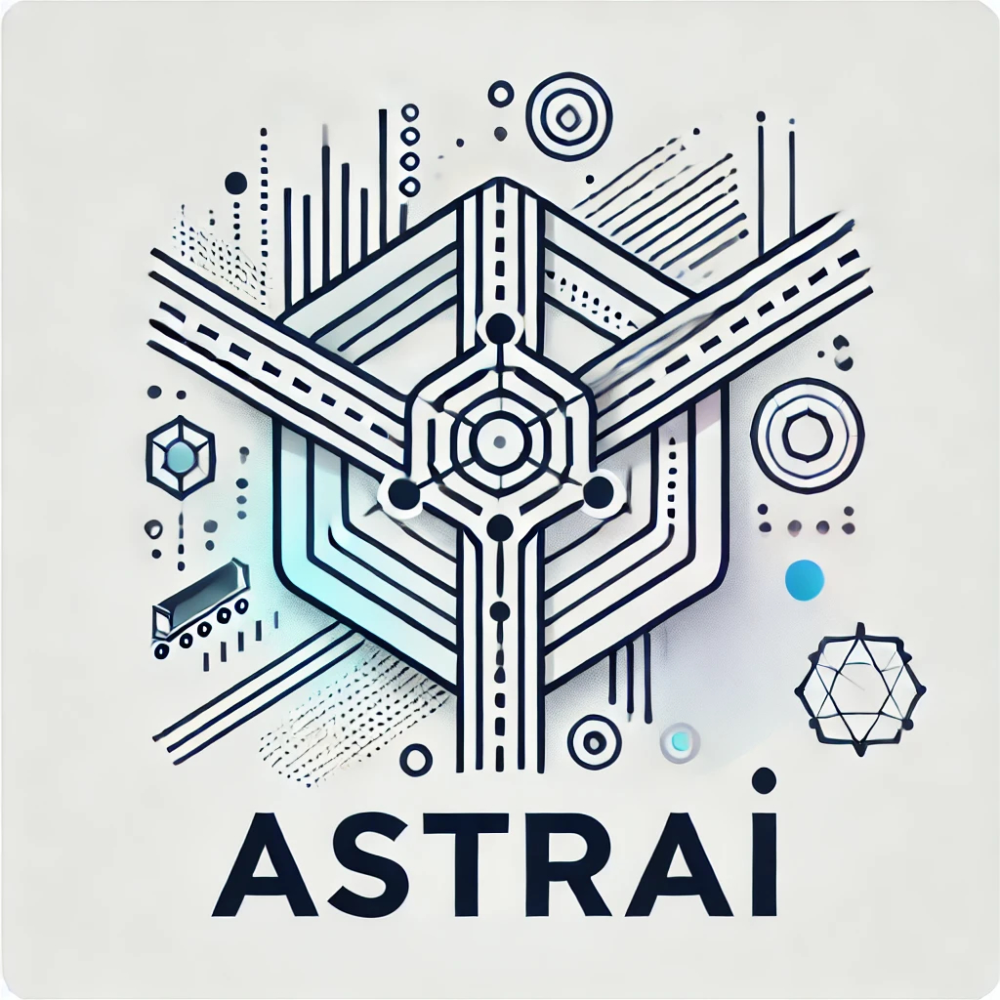

  

# The Art and Science of Transportation Research in the AI Era

:mortar_board: 6-CP seminar (Winter Semester 2024/25)\
:clock1130: Wednesdays 11:40-15:00\
:school: L402/231

## Course description

In today’s rapidly evolving AI-mediated world, the way of conducting scientific research is undergoing significant transformation. The ability to understand fundamental concepts in research design and methodology, while harnessing emerging computational techniques and tools, is crucial for addressing contemporary challenges and advancing knowledge across various fields. This seminar "The Art and Science of Transportation Research in the AI Era" (ASTRAI) responds to the need to prepare you to thrive in a rapidly evolving, technology-driven world by integrating computational and data science techniques into your studies. While the examples primarily focus on transportation, the techniques and methods are transferable across disciplines.

This seminar covers the key concepts in research design and methodology, such as operational definitions, measurements, and generalizability, and exposes you to a variety of computational research methods and techniques, such as web scraping, data wrangling in Python and R, SQL, Power BI, Tableau, and version control with git.

The goal of this seminar is not to create programmers, computer scientists, or computational engineers, but rather to familiarize and de-mystify computational methods and data science techniques by striking a balance between the "how to" and the "why." So, in essence, this course aims to empower you to understand and apply these methods and techniques effectively within your respective fields of study. By the end of the course, you will:

*	Understand the fundamental concepts in research design and methodology.
*	Effectively formulate research questions and design a study.
*	Develop proficiency in data science tools and techniques.

## Required literature

This class has no required textbook. We will direct you toward online resources when necessary.

## Course activities

**Class participation**: Active class participation is critical to the success of this course. As such, you are expected to attend class every week, bring your laptop and its power cord, and actively participate in the in-class activities.

**Pre-class requirement**: From time to time, you will need to sign up for accounts or install essential software before class so that we can focus on implementation and experimentation in class.

**In-class activities**: Practicing coding, debugging, etc. This allows you to immediately implement and get feedback on what you have just learned.

**Student-led (YOU-lead) learning**: This seminar is student-centered, which means you are expected to choose a computational tool or a technique you find interesting or relevant to your research proposal (see below for possible topics), study it in-depth, and explain it to your peers in class. This approach allows you to take ownership of your learning while fostering a collaborative learning environment. Good performance in this presentation can improve your final grade by up to 0.4 points.

**Final examination**: You are required to develop a one-page (excluding references) research proposal on a topic of your interest, incorporating computational methods. The proposal should include the current state of the research topic, the research questions, the methodology (including data sources), and the limitations of the chosen methods.

## Possible topics for YOU-lead sessions

They can be anything (within the scope of this course) that you find interesting or useful. They can be a use case of what you have learned from the class or a new tool related to what you have learned. The following are some examples.

**Use cases**: scraping traffic data, creating a dashboard using PowerBI, demonstrating how to use GitHub for teamwork, analyzing survey data with R.

**Methods**: machine learning, agent-based modeling, network analysis, traffic simulation, spatial analysis, regular expressions.

**Packages**: pandas, NumPy, scikit-learn, TensorFlow, PyTorch, matplotlib, seaborn, plotly, folium, shapely, geopandas.

**Tools**: VS Code, Google Colab, JupyterHub.

**Sign up for YOU-lead [here](https://docs.google.com/spreadsheets/d/1esQtwJurQ6PXKDdeY0r3jsSK4SU1G4MgjCqUpfYVKSY/edit?gid=0#gid=0)** by Nov 14.

## Schedule

The schedule and topics may change based on class progress and interests.

Week 1 (Oct 16, 2024): Welcome to ASTRAI, `git`

Week 2 (Oct 23, 2024): Python basics

Week 3 (Oct 30, 2024): Web scraping

Week 4 (Nov 6, 2024): Data wrangling

Week 5 (Nov 13, 2024): Open-source tools, **signing up for YOU-lead**

Week 6 (Nov 20, 2024): Research design and methodology

Week 7 (Nov 27, 2024): R basics (Ezra), `ggplot` (William)

Week 8 (Dec 4, 2024): `pandas`, `matplotlib` (Merlin), `geopandas`, `folium` (Johannes)

Week 9 (Dec 11, 2024): Relational database basics

Week 10 (Dec 18, 2024): Relational database advanced

Week 11 (Jan 15, 2025): Digital twins (Pardis)

Week 12 (Jan 22, 2025): Spatial analysis (Theresa), `plotly` (Ali)

Week 13 (Jan 29, 2025): Pearson correlation (Nicole), PTV Visum (Thorben)

Week 14 (Feb 5, 2025): PowerBI

Week 15 (Feb 12, 2025): Working on your proposal

## Q&A

**How to pronounce ASTRAI?**

A stray (meaning wandering around in AI) or ashtray (meaning we have smoking hot topics). You pick.

**Who is this course for?**

There are people who love coding to the moon and back. And there are people who hate coding to death. This course is for the people in the middle, those who appreciate the value of computational methods and are willing to explore but may feel unsure about where to start.

**With so many free resources available online, what is the value of this course?**

*	The organization of content
*	The filtering of information
*	Direct access to instructors and peers for questions and discussions
